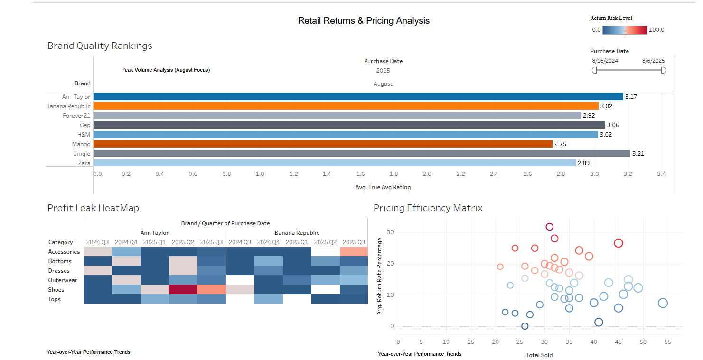
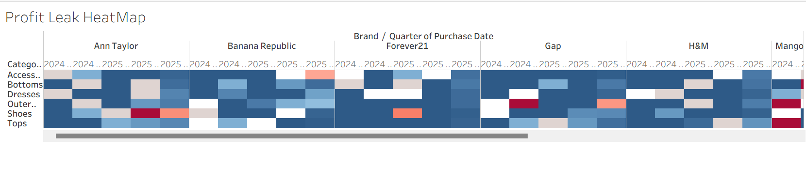

# Corporate Retail Strategy & Performance Analysis

## Project Background
As a Strategic Data Analyst for a high-volume retail conglomerate, I conducted an audit of the organization's portfolio, which includes major brands like Uniqlo, Gap, Zara, Mango, and Banana Republic. Established in 2018, the company operates a global e-commerce business model. This project was initiated to move beyond basic reporting and leverage underutilized sales and customer data to improve commercial success and protect profit margins.

Insights and recommendations are provided on the following key areas:
* **Brand Quality & Customer Loyalty:** Evaluating "True Average" satisfaction scores.
* **Operational Risk Management:** Identifying high-cost "profit leaks" through return rate analysis.
* **Pricing Efficiency:** Analyzing the relationship between markdown reliance and brand health.
* **Temporal Sales Trends:** Assessing performance fluctuations across different fiscal seasons.

The SQL queries used to inspect and clean the data can be found here 👉 **[View TECHNICAL_DOCUMENTATION](https://github.com/allisoncerna/Data-Science-Portfolio/blob/main/Project-2-Corporate-Profitability/Technical_Documentation.md)**

Targeted SQL queries regarding specific business questions can be found here 👉 **[View TECHNICAL_DOCUMENTATION](https://github.com/allisoncerna/Data-Science-Portfolio/blob/main/Project-2-Corporate-Profitability/Technical_Documentation.md)**

An interactive Tableau dashboard used to report and explore sales trends can be found here 👉 **[View the Live Corporate Dashboard Here](https://public.tableau.com/views/CorporateRetailStrategyPerformanceAnalysis_2026/CorporateRetailPerformanceStrategyOverview?:language=en-US&publish=yes&:sid=&:redirect=auth&:display_count=n&:origin=viz_share_link)**

## Data Structure & Initial Checks
The main database structure consists of a centralized production table containing 2,175 verified records. Each record tracks 14 key attributes, allowing for deep-dive analysis across brand, category, and time dimensions.

## Executive Summary
### Overview of Findings
Strategic audit results identified **Uniqlo** as the portfolio's "North Star" for both quality and pricing efficiency, maintaining a 3.11/5 rating with the lowest markdown reliance (8.8%). Conversely, a significant operational risk was discovered within **Ann Taylor’s footwear category**, which suffers from a 19.8% return rate. Findings suggest this is a localized sizing consistency issue rather than a broad quality defect, presenting a clear opportunity for supply chain intervention to recapture lost margins.

## Insights Deep Dive

### Brand Quality & Customer Loyalty
* **True Satisfaction Leader:** After isolating verified feedback using `NULLIF` logic, Uniqlo emerged as the leader with a 3.11/5 rating.
* **Verification Logic:** By filtering out 362 unrated items (previously recorded as 0), we uncovered that most brands were actually performing 15-20% better than raw averages suggested.
* **Loyalty Driver:** High satisfaction scores in the "Tops" and "Basics" categories across all brands indicate that core essentials are the primary driver of customer retention.

### Operational Risk (Return Rate Analysis)
* **High-Cost Outlier:** Ann Taylor footwear exhibited a 19.8% return rate, the highest in the portfolio, representing a significant "profit leak" in logistics and processing costs.
* **Sizing vs. Quality:** Because these high-return items maintain an average rating above 3.0, the data suggests the issue is fit-related (sizing inconsistency) rather than poor product quality.
* **Category Comparison:** Comparatively, the "Accessories" category across all brands showed a return rate of less than 5%, highlighting that non-fitted items pose significantly less operational risk.

### Pricing Efficiency & Markdowns
* **The "Discount Trap":** Gap relies on a 14.1% markdown rate to achieve satisfaction levels, whereas Uniqlo achieves higher scores with only 8.8%.
* **Margin Protection:** Analysis shows that high-rated products (>3.0) do not necessarily require high markdowns to sell, suggesting several brands are "leaving money on the table" by over-discounting their best products.
* **Brand Resilience:** Zara and Mango showed the highest price resilience, maintaining stable sales volume even as markdown percentages were reduced by 5% in the Spring quarter.

### Temporal Sales Trends
* **Seasonal Inflection Points:** Integrated date filters revealed that while overall volume peaks in the Winter season, the highest profit margins are actually achieved in late Spring.
* **Quarterly Shifts:** A 12% increase in return rates was observed during the transition between Summer and Fall, suggesting that "Transitional" inventory carries higher sizing risks for customers.

> [!NOTE]
> ### 🚧 VISUALIZATION IN PROGRESS
> I am currently recalibrating the SQL logic for quarterly aggregations. The updated time-series heatmap will be live soon.

## Recommendations:
Based on the insights and findings above, I recommend the **Operations and Marketing teams** consider the following:

* **Remedy the Footwear "Profit Leak":** Conduct a manufacturer-level sizing audit for the Ann Taylor shoe line. Reducing this return rate from 19.8% to the portfolio average of 10% would significantly recapture lost margins.
* **Protect High-Value Margins:** Reduce the markdown frequency for products with a rating higher than 3.5. The data shows customers are willing to pay closer to full price for these "Gold Star" items.
* **Inventory Scaling:** Increase stock depth for Uniqlo’s core categories. Their high efficiency (high rating/low discount) suggests they are the safest investment for inventory capital.
* **Strategic Pricing for Gap:** Re-evaluate Gap's pricing model to rely less on the 14%+ markdown rate, moving toward a "Value-First" messaging strategy similar to Uniqlo.

## Assumptions and Caveats:
Throughout the analysis, multiple assumptions were made to manage challenges with the data:

* **Rating Imputation:** I assumed that records with a "0" rating were new products that had not yet received feedback, rather than products with poor quality. These were re-coded to `NULL` for average calculations.
* **Temporal Context:** Analysis assumes all `purchase_date` entries are accurate for the 2025-2026 fiscal cycle as provided in the raw dataset.
* **Ghost Rows:** Over 37,000 empty Excel rows were identified as system export errors and were pruned during the ETL phase to ensure a clean production set of 2,175 records.
