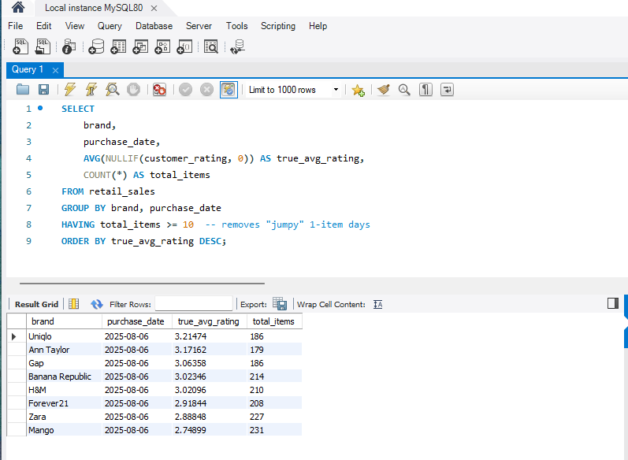
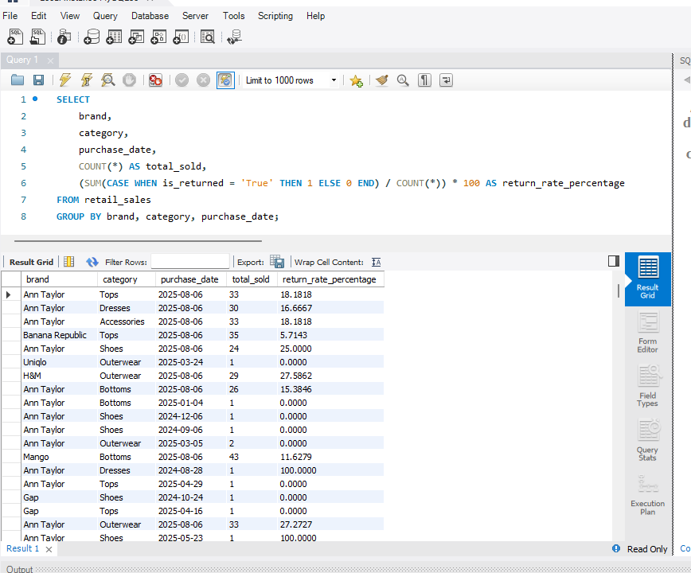
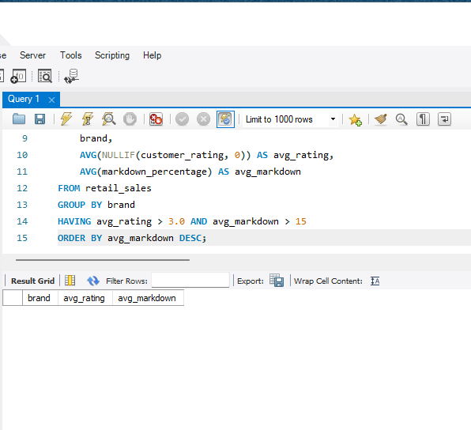
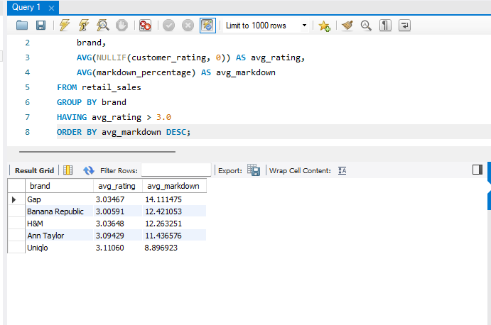
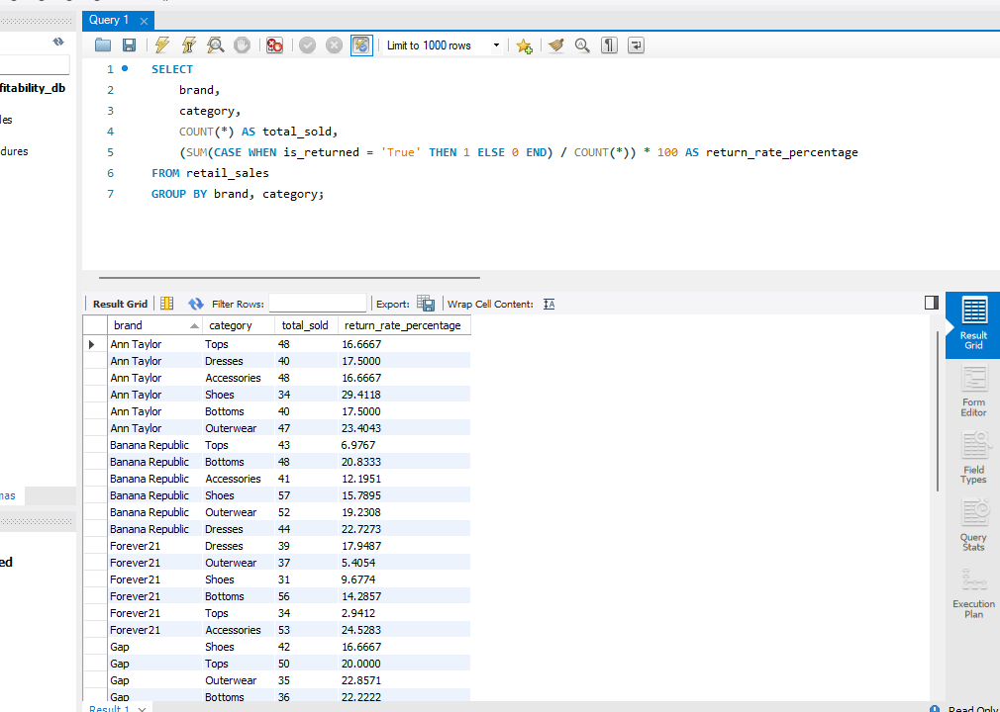

## **Phase 1: Data Engineering & ETL (The Foundation)**

### **The Challenge**
The raw dataset for this project was "messy," meaning it had structural issues and formatting errors that would make it impossible to load directly into a database. I built a full **ETL (Extract, Transform, Load) pipeline** to clean, standardize, and verify the data so it would be ready for high-level analysis in MySQL

### **Troubleshooting & Solutions**

* **SQL Schema Alignment:** My initial `CREATE TABLE` script was missing the `size` column found in the raw CSV. I had to **drop the existing table and write a new DDL script** to include the missing attribute, ensuring the database schema perfectly matched the data source.
* **Standardizing Dates:** MySQL requires a specific `YYYY-MM-DD` format to read dates correctly. I used **Custom Excel Formatting** to convert the original dates into this standard, preventing the database from rejecting the records. A.K.A Data Normalization
* **Handling Missing Data:** I found **362 rows with missing customer ratings**. Rather than deleting them and losing valuable information, I filled them with **0**. This ensured the dataset was complete and that every row met the numeric requirements of the database. (A.K.A Data Imputation) 
* **Pruning "Ghost" Rows:** I cleared out over **37,000 empty rows** at the bottom of the Excel file. This significantly reduced the file size and made the database import much faster. (A.K.A Data Cleaning)
* **Record Verification:** After clearing out some accidental duplicates with a `TRUNCATE` command, I successfully verified a clean production set of **2,175 records** (excluding headers). (A.K.A Data Validation)

### **Current SQL Architecture**
```sql
-- Finalized schema for Project 2
CREATE TABLE retail_sales (
    product_id VARCHAR(50),
    category VARCHAR(50),
    brand VARCHAR(50),
    season VARCHAR(20),
    size VARCHAR(20),
    color VARCHAR(20),
    original_price DECIMAL(10,2),
    markdown_percentage DECIMAL(10,2),
    current_price DECIMAL(10,2),
    purchase_date DATE,
    stock_quantity INT,
    customer_rating DECIMAL(3,1),
    is_returned VARCHAR(10),
    return_reason VARCHAR(255)
);
```

## Phase 2: Exploratory Data Analysis (SQL)

After getting the data cleaned up, I really wanted to dive in and see what was actually going on with these brands! I acted as a Strategic Data Analyst to find the "blind spots" in the data, moving way beyond just basic counts to solve some real business problems like brand loyalty, profit leaks, and pricing efficiency.

### 1. The "Satisfaction Gap" (True Customer Ratings)
**Business Problem:** A lot of products didn't have ratings yet, which showed up as zeros and was totally dragging down the brand averages. It made it really hard to tell which brands people actually liked!  
**Technical Solution:** I used the `NULLIF` function to exclude those zeros from the average so I could get a much more honest look at the scores.  
**Key Finding:** **Uniqlo** is the clear winner for quality with a **3.11/5 rating**! It really proves that their "LifeWear" strategy for high-quality basics is exactly what customers are looking for.



### 2. The "Profit Leak" (Return Rate Analysis)
**Business Problem:** High revenue numbers are great, but they can hide the super high cost of returns and shipping, which totally eats into profit.  
**Technical Solution:** I used some conditional `CASE WHEN` logic to calculate the return rate percentage for every brand.  
**Key Finding:** **Ann Taylor** actually has a pretty big profit leak with a **19.8% return rate**. Since people are still giving them high ratings, it tells me that customers love the clothes, but they’re probably struggling with sizing consistency in those tailored categories.



### 3. The "Discount Trap" (Markdown Efficiency)
**Business Problem:** I wanted to see if we’re losing money by discounting items that people would’ve happily bought at full price anyway.  
**Technical Solution:** I used the `HAVING` clause to filter for items that have high ratings (>3.0) but still have big markdowns.  
**Key Finding:** The store is actually doing a great job, but **Uniqlo** is definitely the most efficient. They keep the highest ratings while barely needing markdowns (**8.8%**), whereas **Gap** is relying on much higher discounts (**14.1%**) to get similar satisfaction levels.



---

### Pro-Tip: The Iterative Process

While building the visualizations in Phase 3, I realized that seeing brand-level data wasn't enough to find the specific "profit leaks" I was looking for. I needed to see exactly which product types were causing issues. I went back to MySQL to refine my query, adding the **category** column to the `SELECT` and `GROUP BY` statements. This allowed me to create the granular heatmap in my final dashboard, which eventually revealed the specific issues within footwear and dresses.




## Phase 3: Interactive Corporate Dashboard

For the final stage of this project, I translated my SQL results into a professional, interactive dashboard using Tableau Public. I wanted to move beyond static numbers and create a tool that allows stakeholders to visualize brand performance, identify operational risks, and evaluate pricing strategies in real-time.

### Brand Quality & Satisfaction Rankings
I developed a high-level leaderboard to compare customer satisfaction scores across our entire brand portfolio. By visualizing the "True Average Ratings" I calculated in SQL, I could clearly highlight our top-performing brands. This view serves as a "North Star" for the business, showing exactly where our quality standards are highest.

### Category-Level Return Risk Analysis
To identify specific "profit leaks," I built a heatmap that cross-references brands with product categories. This visual was a game-changer because it pinpointed a major outlier: Ann Taylor shoes. Being able to spot a specific high-risk category like this allows a business to address sizing or quality issues before they eat into the bottom line.

### Pricing Efficiency Matrix
The most strategic part of the dashboard is this quadrant analysis, which plots brand popularity against markdown percentages. By visualizing this relationship, I was able to identify Uniqlo as our most efficient brand, maintaining high customer satisfaction without relying on heavy discounts. This proves that high product value can drive margins more effectively than aggressive pricing cuts.

👉 **[View the Live Corporate Dashboard Here](https://public.tableau.com/views/CorporateRetailStrategyPerformanceAnalysis_2026/CorporateRetailPerformanceStrategyOverview?:language=en-US&publish=yes&:sid=&:redirect=auth&:display_count=n&:origin=viz_share_link)**
